# TRDF-Prüfmodul – Kurzanleitung

Die Bilder zeigen die Beispielserie 2026B051 mit erfundenen Werten.

## 1. Starten und anmelden

1. **Doppelklick** auf `TRDF-Pruefmodul-x86.exe`. Eine Installation ist nicht nötig.
2. Mit den **LIMS-Anmeldedaten** anmelden:
   * **Oracle-Benutzer** – in der Regel der Nachname
   * **Passwort**
   * **Datenbank** – steht fest auf `LIMS`
3. **Anmelden** klicken. Der Benutzername wird gemerkt, das Passwort nie.

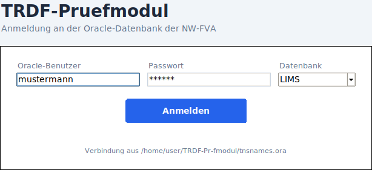

## 2. Serie abfragen

1. **Serie** aus der Liste wählen oder eintippen.
2. **Abfragen** klicken.
   * Führt die Serie **eine** TRDF-Methode, wird sie sofort geladen.
   * Führt sie **mehrere**, die gewünschte unter **Untersuchungsmethode** wählen. Die Auswahl lädt die Serie.

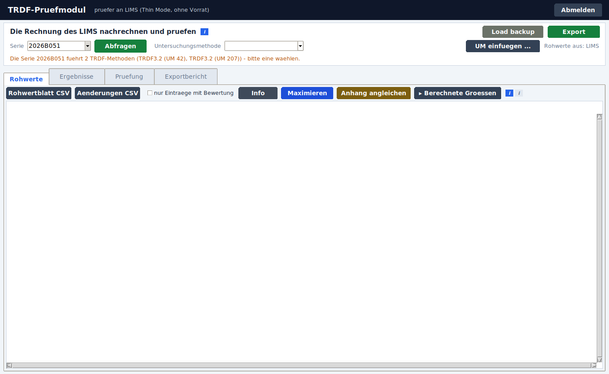

Danach stehen Methode und Probenart oben neben der Überschrift. Die Statuszeile darunter sagt, was gerade passiert.

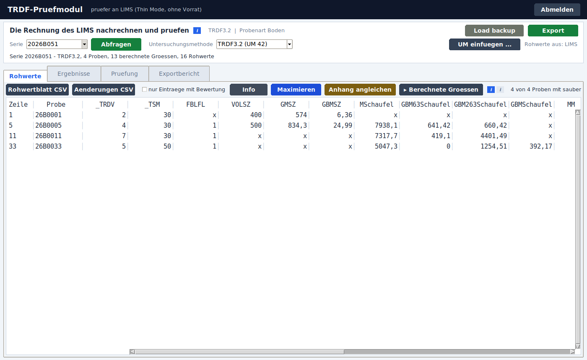

## 3. Werte im LIMS noch nicht gespeichert? UM einfügen

Sind die Rohwerte im LIMS noch nicht gespeichert, kommen sie aus der Probenvorbereitung:

1. In der Probenvorbereitung **aktueller Block → kopieren**.
2. Im Prüfmodul oben rechts **„UM einfuegen …“** klicken. Es öffnet sich ein eigenes Fenster.
3. Mit **Strg+V** einfügen und **Uebernehmen** klicken.

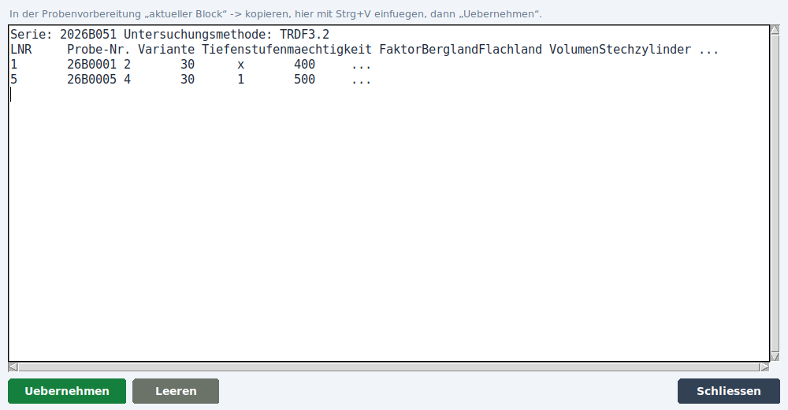

Danach
* wird **mit den eingefügten Werten gerechnet**; oben rechts steht „Rohwerte aus: eingefuegter UM“,
* sind die Werte, die im LIMS noch fehlen, **rot** für den **Export** vorgemerkt (Abschnitt 7),
* lassen sich alle Werte noch **ändern** (Abschnitt 4).

Gut zu wissen:
* Werte, die schon im LIMS stehen, werden nicht überschrieben; weicht die eingefügte UM davon ab, ist die Zelle **amber** markiert.
* **Leeren** im Fenster schaltet zurück auf die Rohwerte aus dem LIMS.
* Der eingefügte Inhalt bleibt erhalten, auch wenn das Fenster geschlossen wird.

## 4. Werte ändern – wie in Excel, mit Live-Rechnung

* Im Reiter **Rohwerte** eine Zelle anklicken und tippen. Der alte Inhalt ist markiert und wird überschrieben.
* **Tab** geht nach rechts, **Pfeile** in alle Richtungen, **Eingabe** eine Zeile tiefer.
* Jede Änderung wird **sofort neu gerechnet**.
* **„▸ Berechnete Groessen“** klappt über den Rohwerten die berechneten Größen auf. Die Grenze dazwischen lässt sich ziehen.

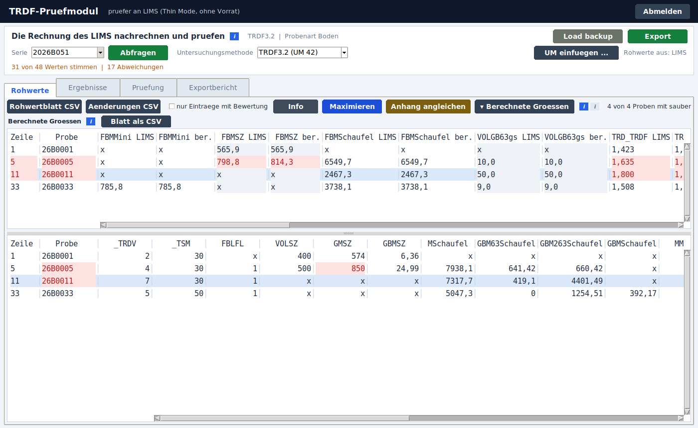

**So sieht man, was sich geändert hat:**
* **Rot** sind
  * der von Hand geänderte Wert (im Bild GMSZ = 850 bei 26B0005),
  * die Probennummer der geänderten Zeile,
  * jede berechnete Größe, die sich dadurch verschoben hat. Diese Größen stehen oben im Bild sowie im Reiter **Ergebnisse** und im Reiter **Pruefung**.
* **Hellblau unterlegt** ist die Probe, in der gerade getippt wird. Sie ist in allen Tabellen unterlegt und wird oben automatisch in den Blick gerollt.

### Tastenkürzel

Die Tastenkürzel stehen auch im grauen **i** neben den Knöpfen der Rohwerte.

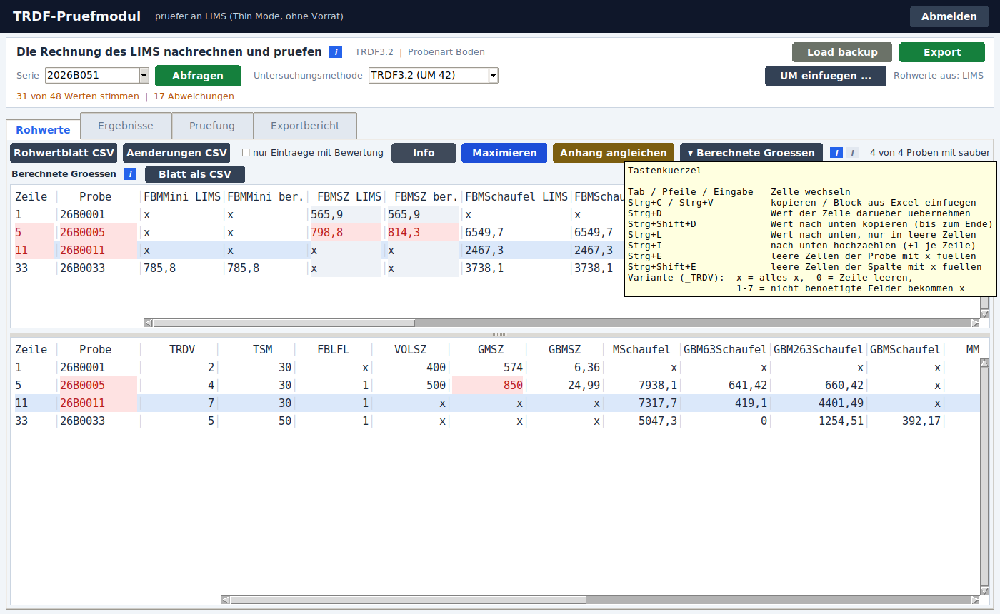

| Taste | Wirkung |
|---|---|
| Strg+C / Strg+V | Zelle kopieren / Block aus Excel einfügen (läuft nach unten und rechts weiter) |
| Strg+D | Wert der Zelle **darüber** übernehmen |
| Strg+Shift+D | Wert **nach unten** kopieren, bis zum Ende der Spalte (überschreibt) |
| Strg+L | Wert nach unten kopieren, **nur in leere** Zellen |
| Strg+I | nach unten **hochzählen**: Wert, Wert+1, Wert+2 … |
| Strg+E | leere Zellen der **Zeile** (Probe) mit `x` füllen |
| Strg+Shift+E | leere Zellen der **Spalte** mit `x` füllen |

„Leer“ heißt: Es steht wirklich nichts da. Ein `x` bedeutet „hier soll nichts stehen“ und wird von Strg+L und Strg+E nicht überschrieben.

### Spalte Variante (`_TRDV`)

| Eingabe | Wirkung in der Zeile |
|---|---|
| `x` | alle Rohwerte bekommen `x` |
| `0` | alle Rohwerte werden geleert |
| `1`–`7` | die Felder, die diese Variante nicht braucht, bekommen `x` |

Wird eine Variante mit Strg+Shift+D nach unten kopiert, wirkt sie in jeder Zeile.

## 5. Zusammensetzungsblock einer Probe

Ein **Klick auf die Probennummer** öffnet den Block der Probe als eigenes Fenster.
* Links die Probe im Boden: Feinboden, gewogener Grobboden 2–63 mm, geschätzter Grobboden > 63 mm.
* Rechts die Schaufelprobe nach Volumen – nur, wenn ihre Masse weder 0 noch `x` ist.
* In der Mitte die Zahlen, aus denen gerechnet wird.
* Darunter die Legende: je Lage eine Zeile, die Prozente untereinander. Dieselbe Lage steht bei Probe und Schaufelprobe in derselben Zeile.

Der Block **rechnet bei jeder Eingabe live mit**. **Pfeil hoch/runter** blättert zur nächsten Probe.

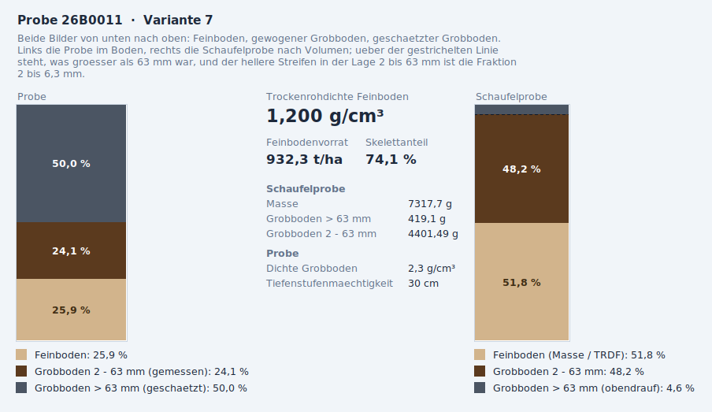

## 6. Prüfung und der Bereich „Bild“

Der Reiter **Pruefung** zeigt je Probe die bodenphysikalischen Werte und in der Spalte **Bewertung**, was auffällt. Dazu gehören:
* Skelettanteil außerhalb von 0–100 %,
* zu große Differenz zwischen gemessenem und geschätztem Skelettanteil,
* negativer Feinbodenvorrat,
* Trockenrohdichte außerhalb des Sollbereichs.

Amber markiert, was beanstandet wird, rot, was von Hand bewegt wurde.

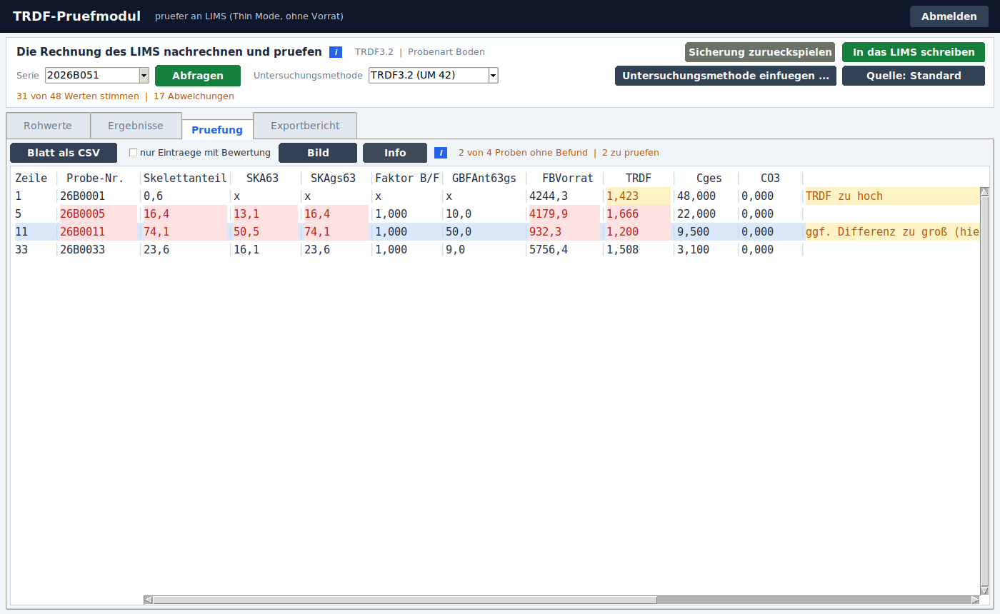

Der Knopf **Bild** zeigt die **Trockenrohdichte über dem organischen Kohlenstoff**, alle Proben der Serie auf einmal.
* **Jeder Punkt** ist eine Probe.
* Die **blauen Bänder** sind der Sollbereich je Kohlenstoffklasse: das dunklere gilt ohne Carbonat, das hellere mit Carbonat.
* Farben der Punkte:
  * **rot** – liegt außerhalb des Sollbereichs,
  * **violett** – wurde von Hand bewegt,
  * **grau** – ohne Aufschluss (kein Cges); steht am linken Rand.
* **Ein Klick auf einen Punkt** öffnet den Zusammensetzungsblock dieser Probe.

So sieht man auf einen Blick, ob eine einzelne Probe herausfällt oder die ganze Serie an einer Klassengrenze liegt.

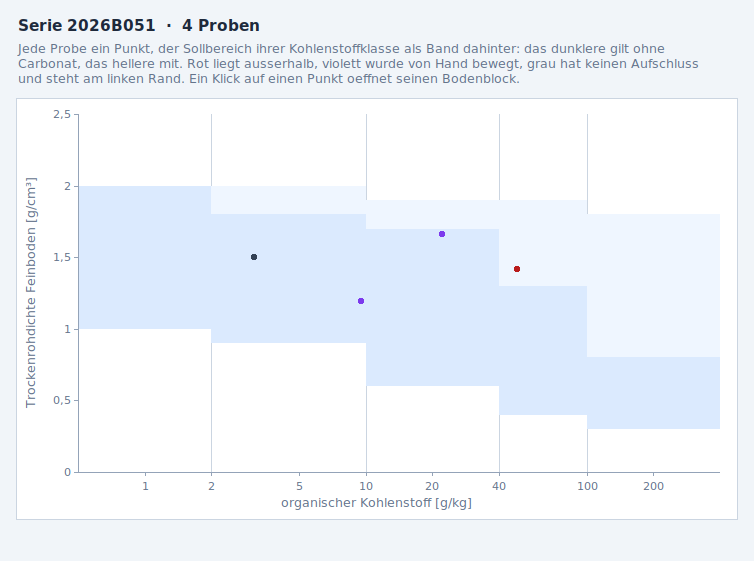

Der Reiter **Ergebnisse** zeigt je Größe nebeneinander, was im LIMS gebucht ist (**LIMS**) und was das Prüfmodul rechnet (**ber.**). Amber heißt, dass beides auseinandergeht; rot heißt, dass es von Hand bewegt wurde. **Ergebnisblatt als CSV** legt die Tabelle als Datei ab.

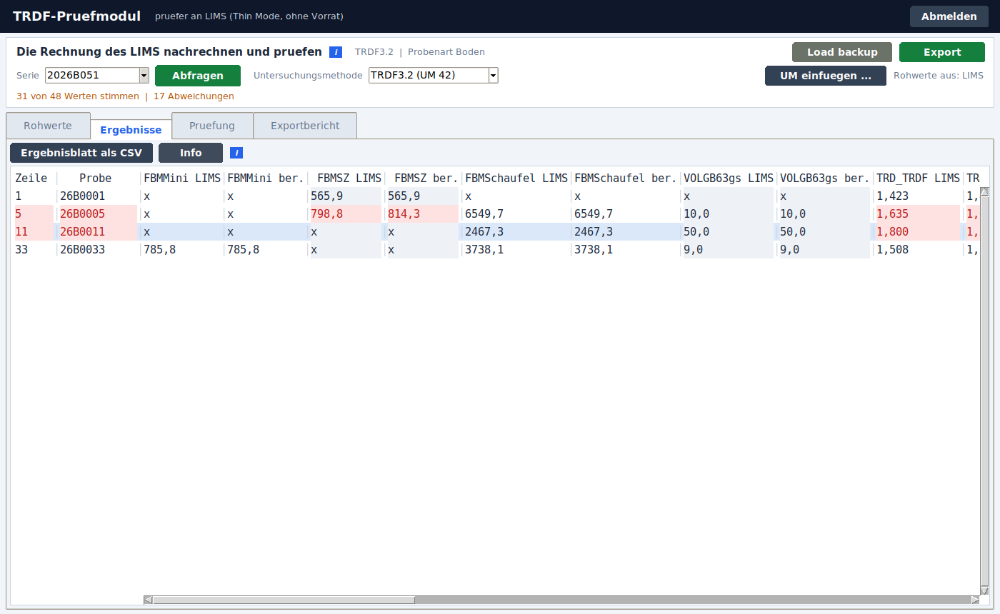

## 7. Daten an das LIMS senden

### Senden

**Export** (grüner Knopf oben rechts) klicken. Gesendet werden:
* jeder **von Hand geänderte** Rohwert, der vom LIMS abweicht,
* jeder aus der eingefügten Untersuchungsmethode **vorgemerkte** Wert,
* jede **berechnete Größe**, die sich dadurch verschoben hat.

Abweichungen, die schon vorher bestanden, werden nicht automatisch gesendet.

### Änderungen bestätigen

Vor dem Senden zeigt eine **Übersicht** jeden Wert einzeln: Probe, Größe, Art (Rohwert oder berechnet), Prüfmethode, Ziel, **Wert aktuell LIMS** und **Wert neu**.
* Gelb hinterlegte Zeilen haben im LIMS keine Ergebniszeile; sie werden nur gemeldet.
* Violett hinterlegte Zeilen wurden schon früher korrigiert.

**Sichern und schreiben** bestätigt, **Abbrechen** schreibt nichts.

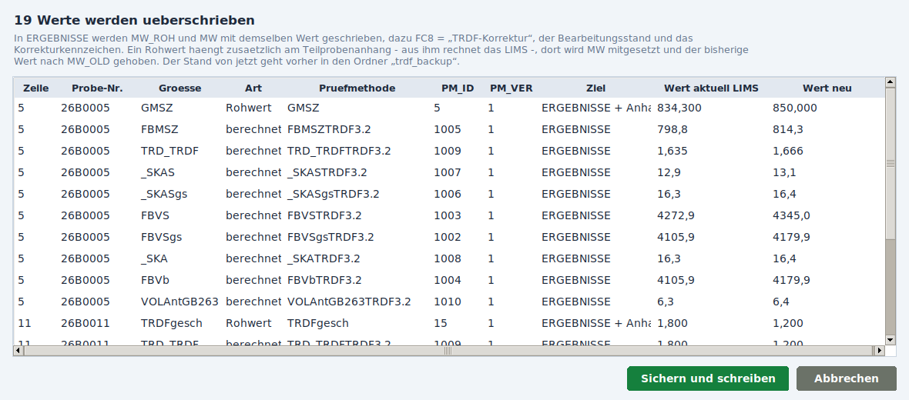

Nach der Bestätigung passiert Folgendes:
1. Der bisherige Stand wird gesichert, im Ordner **`trdf_backup` neben der exe** als Datei `<Serie> <Datum Uhrzeit>.csv`. Ohne Sicherung wird nicht geschrieben.
2. Ergebniszeile und Teilprobenanhang werden **in einem Schritt** geschrieben.
3. Es wird **nachgelesen**, ob jeder Wert angekommen ist. Eine Meldung nennt die Zahl der geschriebenen Zeilen. Werte, die danach noch wie vorher dastehen, werden ausdrücklich gemeldet.

### Änderungsanzeige: der Exportbericht

Der Reiter **Exportbericht** zeigt den letzten Sendevorgang:
* je Probe eine Zeile, je geänderter Größe eine Spalte,
* in der Zelle **alt → neu**,
* zuerst die Rohwerte (rot, von Hand geändert), danach die berechneten Größen, die mitgewandert sind.

Darüber stehen Serie, Zeitpunkt, Anzahl und der Pfad der Sicherung. **Bericht als CSV** legt den Bericht neben die Sicherung.

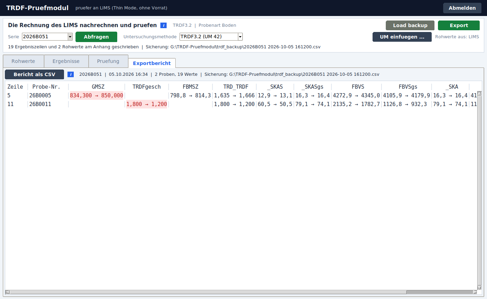

### Rückgängig machen

**Load backup** klicken und die Datei aus `trdf_backup` wählen. Dieselbe Übersicht zeigt jetzt den umgekehrten Weg: „Wert neu“ ist der Stand von vor der Korrektur. **Zurueckspielen** stellt Ergebniszeile und Teilprobenanhang wieder her.

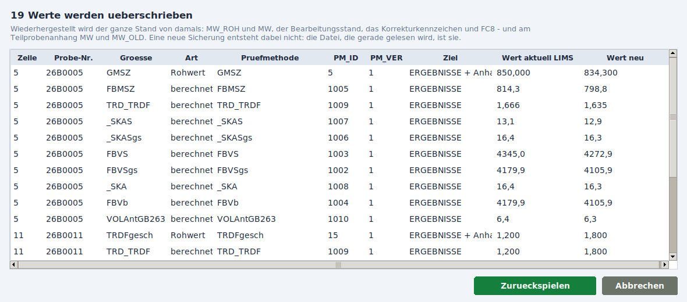

## 8. Ansicht einrichten und Blätter

* **Info** öffnet die Legende einer Tabelle. Dort lassen sich festlegen:
  * eigene Beschreibungen der Spalten,
  * die Spaltenreihenfolge (ziehen),
  * welche Spalten fest stehen bleiben und welche ausgeblendet sind,
  * was in der Kopfzeile steht.

  Gespeichert wird in `einstellungen\` neben der exe; beim nächsten Start ist alles wieder da. Ebenso gemerkt werden die zuletzt abgefragte Serie und ob die berechneten Größen aufgeklappt sind.

* **Variante x ausblenden** (in Rohwerte, Ergebnisse und Pruefung, von Haus aus aus) lässt die Proben weg, deren Variante `x` ist. Das betrifft nur die Anzeige – beim Export werden auch Änderungen an ausgeblendeten Proben geschrieben.
* Die blauen **i** erklären, was eine Tabelle zeigt; das graue **i** listet die Tastenkürzel.
* Als CSV ablegen lassen sich **Rohwertblatt**, **Aenderungen**, **Ergebnisblatt**, das **Blatt** im Reiter Pruefung und der **Bericht**. Ablage im Ordner `TRDF-Pruefung` bzw. `trdf_backup` neben der exe.
